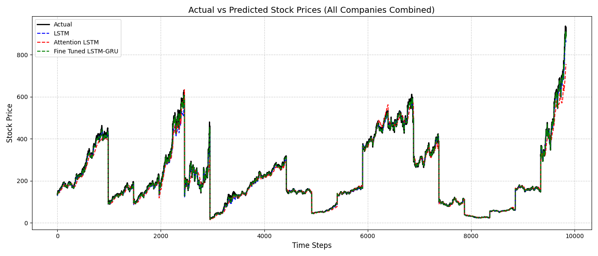

# Financial-Management-App
# Stock Price Forecasting — Multi-Model Comparison

Predicts stock prices for multiple companies using LSTM, GRU, 
Attention-LSTM, and ARIMA. Models are trained and evaluated 
side-by-side to identify which generalizes best.

## Models & Results
| Model          | RMSE  | MAE   | R²   |
|----------------|-------|-------|------|
| LSTM           | x.xx  | x.xx  | 0.xx |
| GRU            | x.xx  | x.xx  | 0.xx |
| Attention-LSTM | x.xx  | x.xx  | 0.xx |
| ARIMA          | x.xx  | x.xx  | 0.xx |

## Tech Stack
Python, TensorFlow/Keras, Scikit-learn, Statsmodels, 
pmdarima, Pandas, Matplotlib, Streamlit

## How to Run
pip install -r requirements.txt
python src/train.py       # trains all models, saves .npy files
python src/evaluate.py    # generates plots and metrics
streamlit run app.py      # launches the web interface

## Results 

